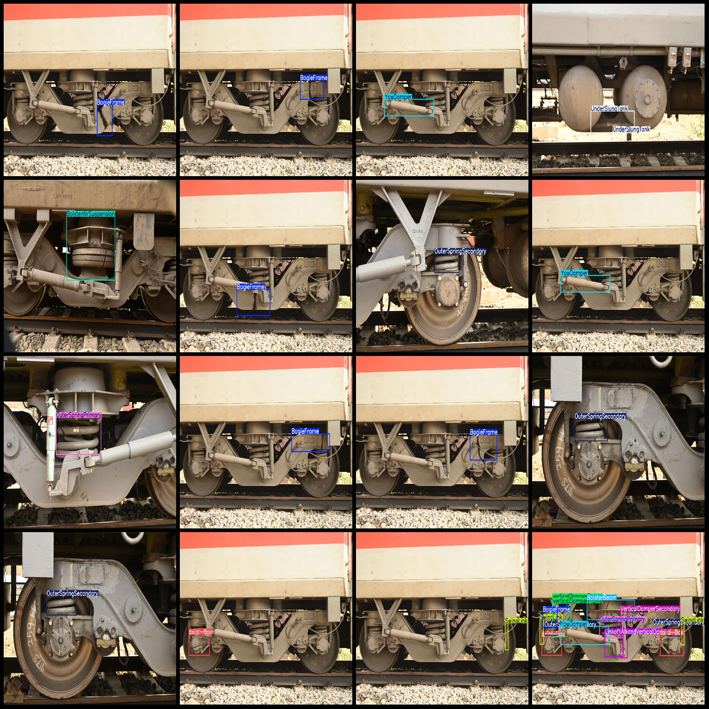
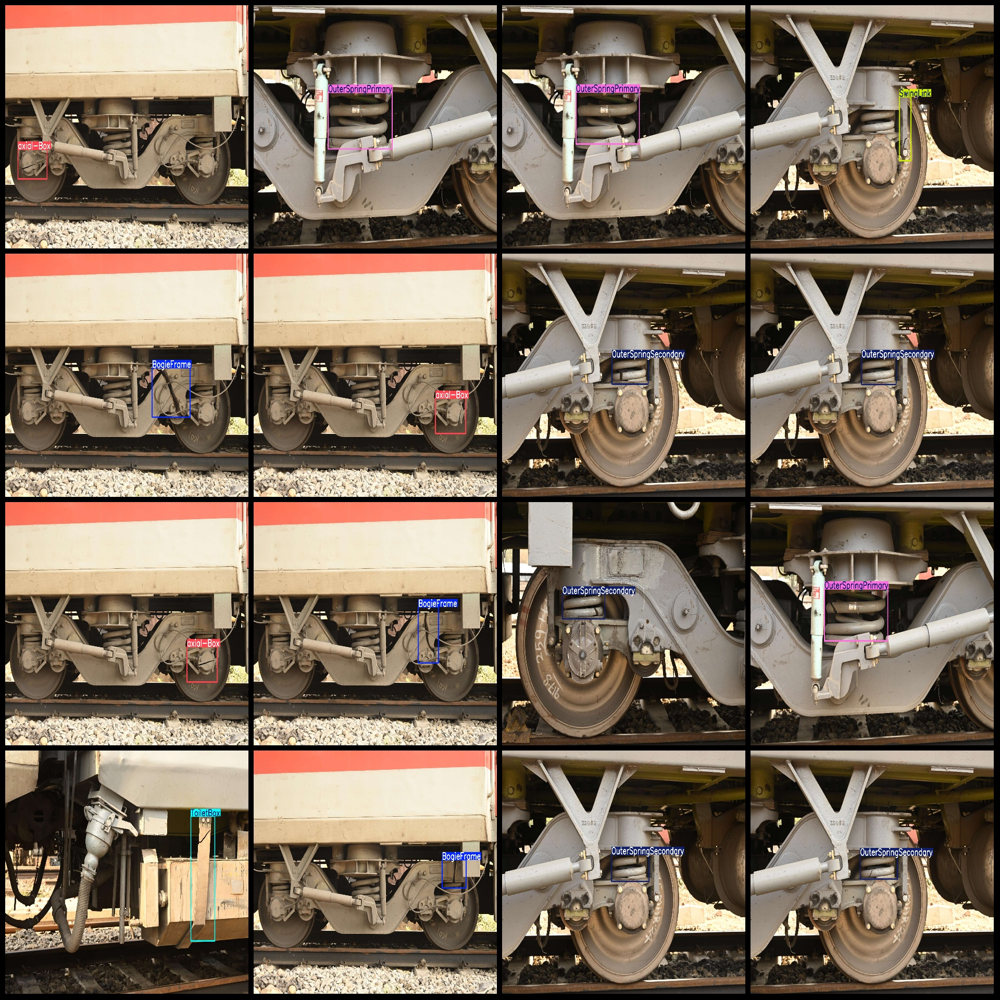

# Intelligent Railway Locomotive and Passenger Vehicle Parts Inspection Dataset VOC+YOLO Format with 262 Images and 17 Categories

Dataset format: Pascal VOC format + YOLO format (without split path's txtfile, only include jpgimage and corresponding VOC format xmlfile and yolo format txtfile)
number of images: 262  
annotation count: 262  
annotation count: 262  
annotationnumber of classes: 17  
Annotation class names: ["BogieFrame", "BolsterAirSuspension", "BolsterBeam", "ControlArm", "FootBoard", "LinkofYAWandVerticalDamper", "OuterSpringPrimary"]
"OuterSpringSecondary","SwingLink","ToiletBox","UnderSlungTank","VerticalDamperSecondary","WSPCable","WaterPipe","YawDamper","axial-Box","verticalDamperFrame"]  
The number of boxes labeled in each category:
Bogie Frame box count = 47
Bolster Air Suspension box count = 22
The number of bolster beams = 18
Control Arm frame count = 5
Foot Board box count = 10
Link of YAW and Vertical Damper box count = 7
Outer Spring Primary frame count = 35
Outer Spring Secondary box count = 53
Swing Link box count = 21
Toilet Box box count = 5
Under Slung Tank box count = 19
Vertical Damper Secondary Frame Number = 15
WSPCable box count = 13
Water Pipe box count = 2
Yaw damper (yaw damper) frame count = 30
Axial-Box Frame Count = 49
Vertical Damper Frame Box Count = 24
The total number of frames is 375.
image resolution: 1920x1280  
Use annotation tool: labelImg
Annotation rules: draw a rectangle around the class.
Important notes: The dataset has not been divided into training, validation, and test sets, so it needs to be divided by oneself.
Special Disclaimer: This dataset does not guarantee the accuracy of the trained model or the weights file.
Image Preview:
## Images

Here is a pay link on Stripe ( https://buy.stripe.com/3cs8yP7sY87d0vu9AB ). Please contact me lonlonago@foxmail.com after funding $89, and I will send you a complete data files , thank you!

